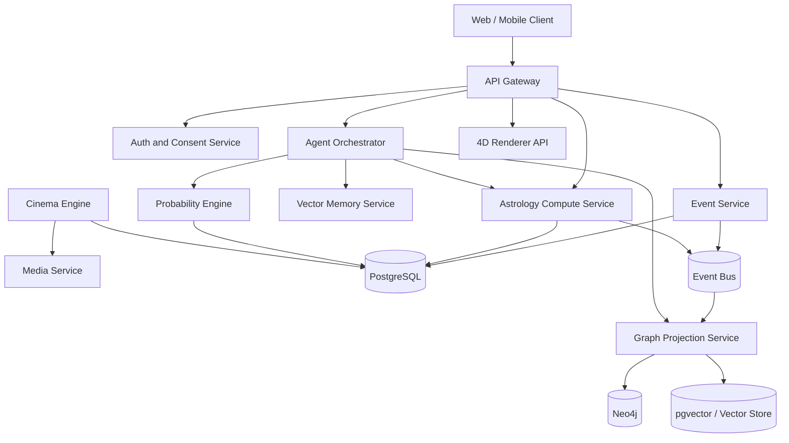

# 03 — System Architecture

## Purpose

Define scalable software architecture for Cosmos Engine.

## Architecture summary

Cosmos is a modular service platform organized around canonical truth, derived projections, AI reasoning, and presentation.



## Service boundaries

### API Gateway

Responsible for request routing, auth verification, rate limiting, tenant identification, and API versioning. The gateway must not own business logic.

### Auth and Consent Service

Owns identity, sessions, OAuth connections, consent grants, data-sharing settings, and permission checks.

### Event Service

Owns canonical life events, journals, dreams, goals, relationships, and media metadata. It writes to PostgreSQL and publishes domain events.

### Astrology Compute Service

Owns deterministic planetary calculations, birth chart generation, transits, progressions, directions, houses, aspects, derived points, and timing windows.

### Graph Projection Service

Consumes canonical events and astrology objects, produces graph nodes and edges, and writes to Neo4j. It must be replayable from canonical storage.

### Vector Memory Service

Embeds event descriptions, notes, agent findings, scripts, and media captions. Supports semantic search with provenance constraints.

### Agent Orchestrator

Runs multi-agent workflows. Agents never directly mutate canonical truth. They propose findings, annotations, forecasts, scripts, or questions.

### Probability Engine

Consumes graph motifs, personal history, feedback, upcoming transits, and similar-pattern retrieval. Produces probability objects with evidence and calibration metadata.

### Cinema Engine

Turns narrative objects into scripts, storyboards, prompts, voiceover, music directions, shot lists, and rendered media jobs.

### 4D Renderer API

Prepares scene payloads optimized for rendering. It does not compute astrology or inference. It streams nodes, edges, trails, labels, and animation states.

## Data flow doctrine

Canonical truth flows outward. Derived systems may be rebuilt.

```text
User Input / Imports
    -> Canonical Store
        -> Domain Events
            -> Graph Projection
            -> Vector Embeddings
            -> Agent Findings
                -> Forecasts
                -> Scripts
                -> Render Scenes
```

## Scalability targets

Initial targets:

- 10,000 active users.
- 1 million events.
- 100 million graph edges.
- 10 million vector embeddings.
- 500 concurrent Observatory sessions.
- 10,000 agent jobs per day.

Long-term targets:

- 1 million active users.
- 1 billion events.
- 100 billion graph edges.
- Multi-region read replicas.
- Tenant-level isolation.
- Batch analytics for aggregate opt-in research.

## Failure strategy

A failed agent cannot corrupt canonical truth. A failed graph projection can replay. A failed vector index can rebuild. A failed video job can retry. A failed forecast must degrade to “not enough evidence”.

## Feature flags

Every advanced feature must be behind a flag:

- `feature.observatory.v1`
- `feature.mirror_points`
- `feature.midpoints`
- `feature.council`
- `feature.forecast_clouds`
- `feature.cinema`
- `feature.aggregate_research`

## Architecture acceptance criteria

- Services can be deployed independently.
- Derived projections can be rebuilt from canonical data.
- Agent outputs are separate from user-authored truth.
- Every public response can expose provenance.
- Privacy permissions are enforced before retrieval.
